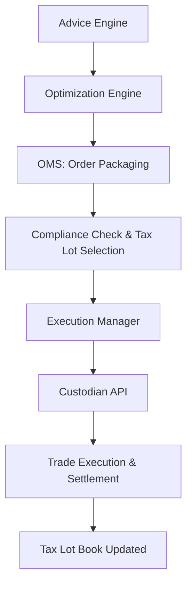

# Trading Infrastructure and Execution for Tax-Aware Investment Platforms

## 1. Introduction

Tax-aware portfolio management requires not only intelligent optimization algorithms but also robust, real-time trading infrastructure. This document outlines the trading architecture necessary to support tax-loss harvesting (TLH), tax-lot aware optimization, and integration with custodial platforms such as Schwab, Fidelity, Pershing, and Apex.

---

## 2. Core Components of a Trading System

A modern tax-aware trading infrastructure consists of the following layers:

- **Order Management System (OMS)**: Coordinates order generation, compliance checks, and batching.
- **Execution Management System (EMS)**: Interfaces with custodians or execution brokers via FIX/REST APIs.
- **Pre-Trade Compliance**: Validates wash-sale constraints, trading restrictions, minimum/maximum lot sizes.
- **Tax-Aware Routing Logic**: Prioritizes trades with tax-lot selection rules (e.g., HIFO, MinTax).
- **Post-Trade Settlement Engine**: Tracks cost basis, realized gains/losses, and updates position books.

---

## 3. Custodian Integration Models

### 3.1 Fidelity/Schwab/Pershing Integration

Each custodian has its own API and trading constraints:

| Custodian | Protocol | Order Cutoff | Lot Selection | Restrictions |
|-----------|----------|--------------|----------------|---------------|
| Schwab    | REST/FIX | 3:00 PM EST  | Yes            | Mutual fund trade windows |
| Fidelity  | REST     | 4:00 PM EST  | Yes            | No fractional lots |
| Pershing  | FIX/CSV  | 2:30 PM EST  | Yes            | Delayed confirmations |

### 3.2 Apex Clearing Integration

Apex supports modern REST APIs and offers real-time trade confirmations. Useful features include:

- Real-time position syncing
- Full lot-level tax reporting
- Intra-day trading windows
- Integrated fractional share trading

---

## 4. Trading Workflow (OMS Layer)

---

## 5. Handling Execution in a Tax-Loss Harvesting Context

### 5.1 Wash-Sale Avoidance

A wash sale occurs if a security is sold at a loss and repurchased within ±30 days.

**Approach:**
- Block repurchases of identical CUSIPs
- Use ETF substitutes with low correlation
- Monitor *all accounts* to apply the rule at the household level

### 5.2 Deferred Execution Queues

To deal with trade windows and rebalancing delays:
- Maintain FIFO execution queues per security
- Prioritize trades with higher tax benefit
- Defer reinvestments if correlated security is not available

---

## 6. Error Handling and Failover

Robust execution systems must:
- Retry failed API calls using exponential backoff
- Fall back to human trade desk escalation on custodian errors
- Log all failed trades for audit

---

## 7. Conclusion

Tax-aware trading requires a real-time, multi-custodian OMS/EMS stack integrated tightly with a tax-lot aware optimization engine. Custodian nuances, order cutoffs, and regulatory compliance must be handled automatically within the trading flow.

